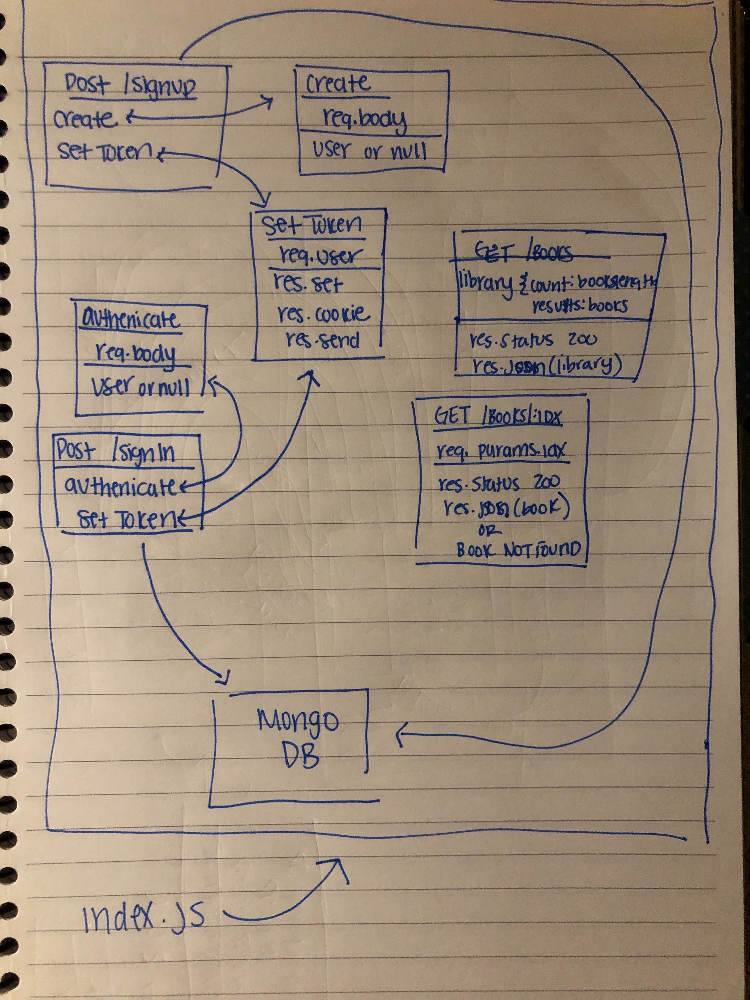

# Lab0-10

## Authentication

### Author: Anna Li

### Links and Resources

- [submission PR](https://github.com/annali-401js/Lab-10/pull/1)
- [travis](https://travis-ci.com/annali-401js/Lab-10)
- [heroku](https://lab-10-auth.herokuapp.com/)

#### Lab Quesions
- Currently, the client is just sending us an object containing the username and password to us, which is why we can just pass along (req.body). What is a better way to do this? 
⋅⋅- The client should encrypt the password using basic auth

- What are the pros and cons of setting res.cookie?
⋅⋅- The use of cookies places trust on the client side. Not all browsers support cookies and users have the option to enable or disable cookies. They do not require server resources. Cookies can persist for long periods of time (days, months, years). Easily manageable. 

#### Setup
 `.env` requirements
- PORT - 3000
- MONGODB_URI - mongodb://127.0.0.1:27017/app
- JWT_SECRET

#### Running the app
- `npm start`
- http://localhost:3000
- `mongod --dbpath=./data`

#### Tests

- Unit tests - 'npm test'
- Lint tests - 'npm run lint'

#### UML

